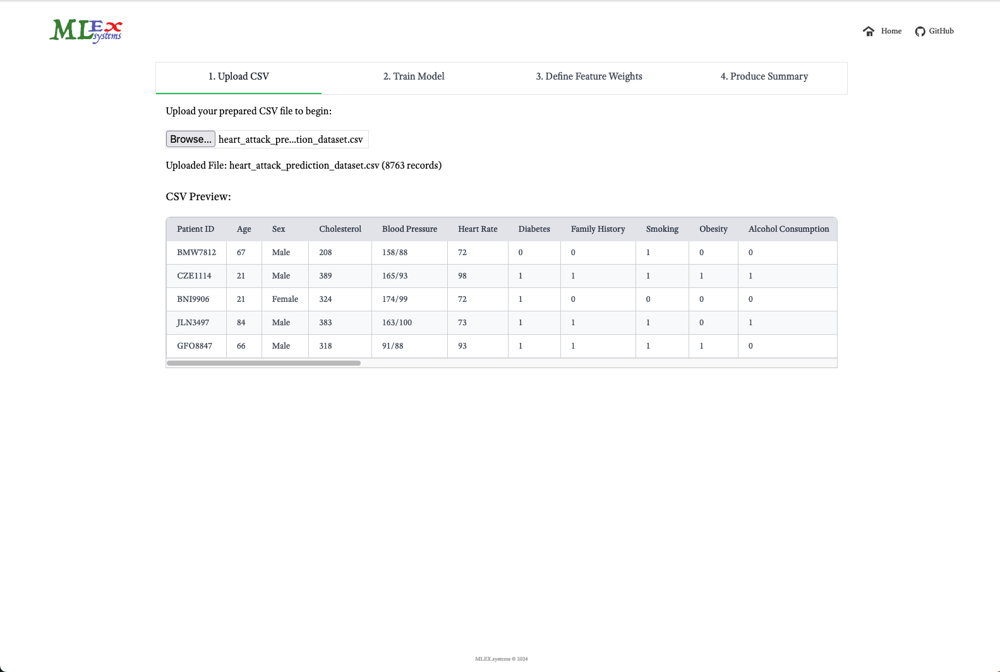
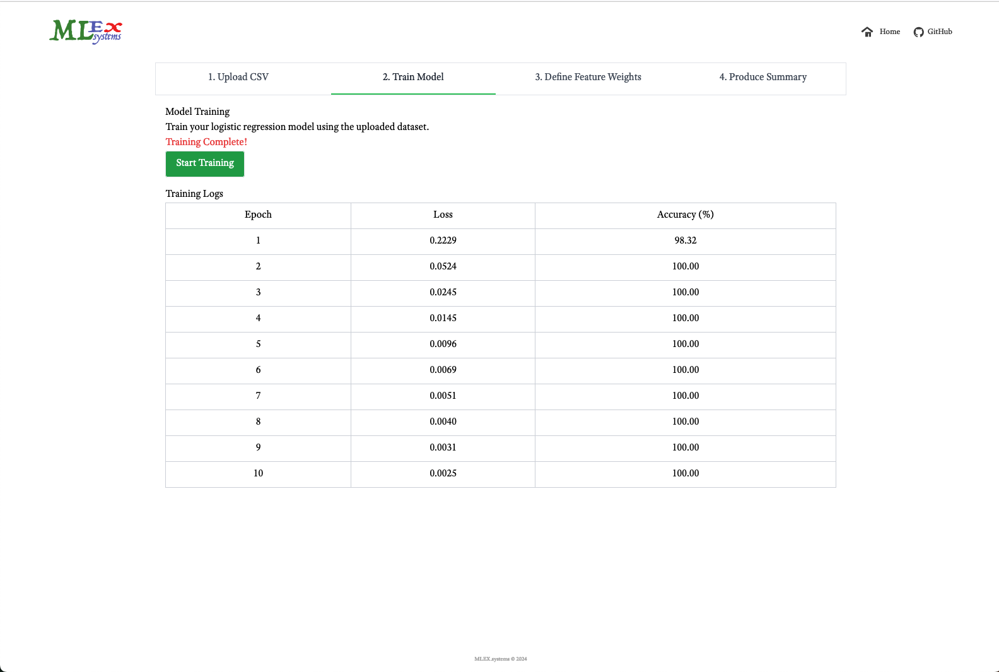
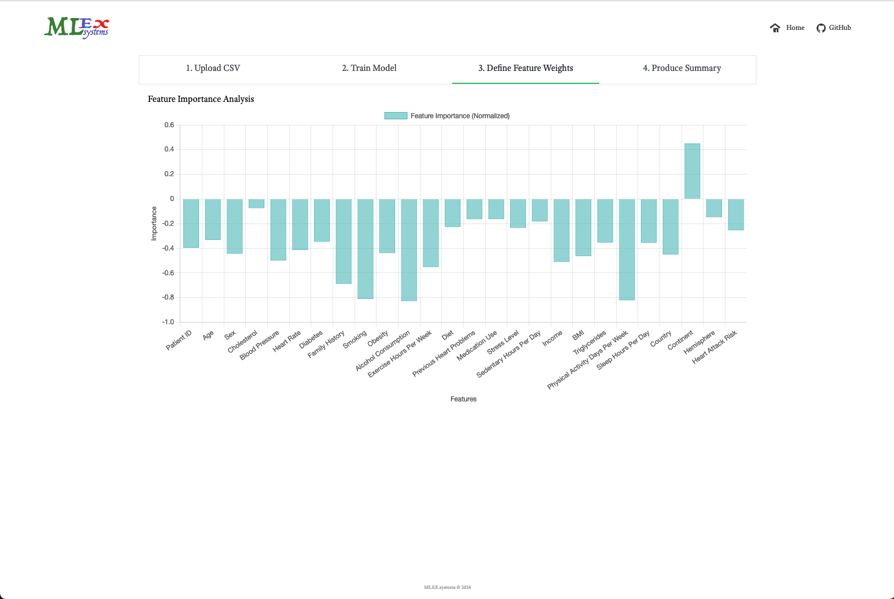

### SPA to Calculate Feature Weights

Feature importance SPA using `Tensorflow.js`.

#### Task Showcase

The task was to build a **Feature Importance SPA** that guides users through a machine learning workflow using a **Heart Attack Prediction Dataset**. The workflow involved the following steps:

1. **Uploading a CSV Dataset**  
   Users upload a dataset for processing.

2. **Training a Logistic Regression Model**  
   Users train the model using the uploaded data, viewing real-time metrics like `loss` and `accuracy`.

3. **Defining Feature Weights**  
   Users identify and adjust the feature importance for the model.

4. **Generating a Summary**  
   Users review the training and feature weights results in a concise summary.

#### SPA Code Base Dependencies

1. ``npm i -S react react-dom react-router-dom @tensorflow/tfjs
``

2. ``npm i -D webpack webpack-cli webpack-dev-server html-webpack-plugin babel-loader @babel/core @babel/preset-env @babel/preset-react css-loader style-loader postcss tailwindcss autoprefixer postcss-loader
   ``

>NB: feel free to check `package.json` for more details.
